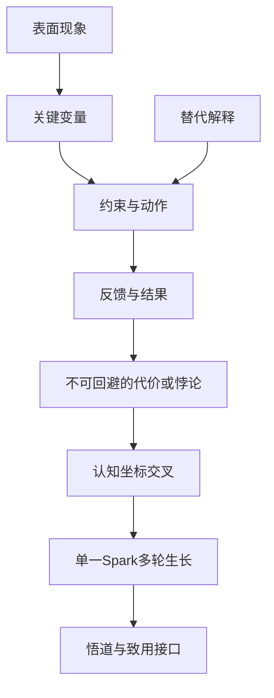

# Stage 2：究理补研与单一Spark多轮生长

进入本阶段前完整读取本文件和 `references/author.md`。S2先回答“为什么会这样”，再从已经成立的机制中寻找值得继续追问的思想冲突；不能把S1事实重新排列成文章目录，也不能从新闻表面直接制造金句。

本阶段允许并要求继续在线补研。凡通过CDP发现信息，先在Google围绕明确机制缺口构造查询，再从结果进入原始页面；垂直站点只作补充。使用`scripts/cdp_capture_pages.py`保存原始页面，Google结果页和摘要不作为证据。所有新页面继续保存到`research/raw_pages/`，研究索引追加到同一个`research/source_pack.json`。

## 准入

必须已有由准出脚本生成的 `research/stage1_receipt.json`。进入S2前先重新运行：

```bash
python skills/wechat-article/scripts/validate_research_outputs.py --topic-dir /absolute/topic/path
```

校验失败时返回S1补抓页面；不得因为目录里存在同名收据而继续。通过后完整读取：

- `source_pack.json.user_materials`
- `source_pack.json.article_profile`
- `source_pack.json.observation_cards`
- `fact_conflicts`
- `known_unknowns`
- 全部 `selected_source_files`

S1提供事实底座，不提供结论。不得把媒体标题、种子URL结构或S1材料分类直接变成文章脊柱。
对于`life_insight`，先检查S1的`reader_context`、`counter_signal`和`boundary_fact`是否真正围绕35岁以后的现实处境；若素材仍主要是触发事件的医学或专业科普，立即返回S1补研，不得用S2理论推演替代缺失的人生观察。

## 分支下潜目标

现有究理闭环、5–7层下潜链、单一Spark和多轮生长协议全部保留，但不同模式必须向不同的最低点推进。

### `life_insight`

- 以用户口述中的一个具体现场、冲突或迟到的理解为入口，不把整段人生按时间线复述；
- 表面经验之后，依次追问当事人当时在保护什么、回避什么、交换什么，又把什么代价推给了未来；
- 最低点优先寻找时间不可逆、身份变化、责任转移、关系中的隐性契约、欲望与能力错位、自我叙事或选择代价，不停在“时间折扣、认知偏差、情绪机制”等科普层；
- 专业知识只在研究后台承担校准和边界作用；每层必须另写一份面向读者的生活化表达，把抽象机制还原成具体处境、关系、选择、感受或代价。是否需要保留术语由准确性和读者理解共同决定；
- Spark必须让35岁以后的读者对自己熟悉的一段经历产生新的解释，并改变未来一次真实选择；不能只是“人到中年才懂”“经历使人成长”之类正确但无刺的常识；
- `challenge`轮必须检验：这是否只是作者个人性格、幸存者偏差、事后合理化或年龄刻板印象；经不起挑战就收窄。

### `technology/event_business_investment`

- 从事件事实下潜到产品能力、客户价值、收入与成本、产业位置、利益分配、竞争壁垒、资本预期和风险变量；
- Spark要揭示事件背后容易被市场忽略的商业约束或投资观察方法，不给具体买卖指令，不把技术先进直接等同于商业成功；
- 至少处理一种相反路径：技术成功但商业失败，或商业繁荣并不来自核心技术优势。

### `technology/practical_playbook`

- 围绕一个可复现目标，按环境与前提、第一次尝试、失败现象、根因定位、修复动作、验证结果和后续优化连续下潜；
- 复杂任务拆成多个小目标和多轮迭代，每轮都保留输入、动作、结果、失败分支与验收信号；
- Spark应从实践中提炼一个会改变读者操作顺序或排障判断的关键认识，正文最终必须交付可复制步骤，而不是泛泛的方法论。

## 究理闭环

按以下顺序执行，必要时重复两到三轮；每轮检索都必须回答一个明确缺口，不进行无目的扩搜。一轮研究可以支撑多次认知下潜，下潜次数不等于搜索轮数。

1. **压缩现象**：用最少事实复述真正需要解释的异常、变化或问题。
2. **提出竞争假设**：至少提出一个主解释和一个替代解释，暂不站队。
3. **列研究缺口**：写清每个假设缺少哪些变量、数据、过程、对照或反例。
4. **定向补研**：先用Google围绕缺口设计多组查询，再进入一手材料、理论说明、历史对照、失败案例、技术文档或可比较样本。
5. **建立下潜链**：每得到一个答案，继续追问“是什么产生、维持或限制了这个答案中的结果”，找到它更底层的原因。下一层必须是上一层的因，上一层必须能被说明为下一层的果。
6. **反例校正**：主动寻找不能被主解释覆盖的情况；反例不仅缩小范围，也可能打开更深机制。
7. **找到最低点**：确认最终无法绕开的约束、代价、悖论或不可兼得关系。
8. **停止下钻**：最低点已经解释主要现象，替代解释得到处理，继续搜索不再改变判断时停止。
9. **映射坐标**：从机制链、最低点和读者处境提取3–6个认知坐标，每个坐标必须绑定机制卡。
10. **种下一个Spark**：只选择一组最有解释价值的坐标交叉，形成一个值得整篇文章追问的问题。
11. **多轮生长**：围绕同一个Spark依次加深机制、拓宽适用范围、接受反证压力并收敛判断；每轮都必须修改或收窄上一轮，而不是换一个新问题。

### 有效下潜标准

S2连续完成五到七层有效下潜。五层是防止解释停在表面的最低门槛，不是鼓励凑层；证据不足以支持第五层时必须继续补研、收窄问题或承认当前主题尚不能准出，不能用抽象词补齐。每一层必须写清：

- 上一层回答了什么；
- 为什么这个答案仍不充分；
- 新材料把解释推进到了哪个更深层级；
- 解释从什么对象、变量或因果位置迁移到了什么位置；
- 这一层使读者原有判断发生了什么具体变化；
- 它与读者正在承担的现实处境有什么关系；
- 它打开了什么下一层问题；
- 哪些证据支持，什么反例限制。
- 当前层解释上方哪一个结果；
- 当前层找到的更底层原因；
- 把相邻两层写成“因为下一层，所以出现上一层”是否仍然准确；
- 面向目标读者时，怎样不用专业背景也能讲清这一层。

相邻两层首先必须成立因果纵深：下一层解释上一层为何产生、为何持续或为何无法轻易改变。在这个前提下，才可以从结果进入生成过程、从个人动作进入约束结构、从单次原因进入反馈循环、从表面收益进入隐含代价、从当下选择进入时间后果或边界条件。它们是可能的因果位置，不是固定顺序或固定栏目。

主链每层必须标记`move_type`、`depth_domain`、`explains_level`、`cause_effect_link`、`reverse_causality_test`和`reader_facing_expression`。第一层解释中心现象，后续每层只能解释紧邻的上一层。`move_type`只能是`causal_deepen`、`constraint_deepen`、`feedback_deepen`、`tradeoff_deepen`或`boundary_deepen`，这些类型都必须服从因果纵深，不能把“约束”“反馈”当成并列话题。并列解释、案例替换、范围拓宽和跨领域类比只能进入支线、坐标或Spark的`broaden`轮，不能占用主链层数。

不得把“行业背景 → 公司介绍 → 市场影响”当成下潜；那只是分类。不得用抽象词升级、理论名词替换或情绪加重代替因果升级。两个心理学概念分别解释同一现象时通常属于并列机制；从牙齿扩展到其它疾病、从一家企业扩展到整个行业时通常属于广度扩展。除非后一层回答了前一层无法回答的新约束，否则不能进入`descent_spine`。对于数字、排名、涨跌、性能或结果问题，先还原它由哪些可计算变量、制度条件或操作过程生成，再讨论意义。

S2发现关键事实错误或缺失时，补充观察材料并更新S1字段；不需要重新扫描选题或重做已有材料。新增事实仍写入 `observation_cards`，新增机制证据写入 `mechanism_cards`。只要 `observation_cards`、事实冲突、未知项或入选事实文件发生变化，就先重新运行 Stage 1 校验，刷新 `stage1_receipt.json`，再继续完成S2。

## source_pack.json追加字段

```json
{
  "mechanism_cards": [
    {
      "id": "M01",
      "research_stage": "s2",
      "knowledge_role": "mechanism",
      "depth_level": 1,
      "parent_mechanism_id": "ROOT",
      "question_answered": "它回答上一层哪一个明确问题",
      "mechanism_claim": "这条证据支持的机制判断",
      "explains": "它解释中心现象的哪一环",
      "explanatory_level": "这次下潜进入了哪种更深解释层级",
      "deeper_question_or_stop": "下一层更根本的问题；若已到最低点则写停止理由",
      "source_type": "primary",
      "source_url": "https://...",
      "raw_page_source": "research/raw_pages/mechanism-example.md",
      "supporting_quote": "可回查短引文",
      "confidence": "high",
      "counterpoint_or_boundary": "反例、替代解释或适用边界",
      "numeric_claim_ids": ["N02"]
    }
  ],
  "mechanism_source_files": [
    "research/raw_pages/mechanism-example.md"
  ],
  "mechanism_research_rounds": [
    {
      "question": "本轮要补哪一个解释缺口",
      "result": "新材料怎样修正了原假设",
      "depth_gain": "本轮如何把解释推进到更深一层",
      "remaining_gap": "仍然未知什么"
    }
  ],
  "descent_spine": [
    {
      "order": 1,
      "depth_level": 1,
      "mechanism_id": "M01",
      "layer_label": "本篇特有的层级名称",
      "move_type": "causal_deepen",
      "depth_domain": "cognition",
      "explains_level": "ROOT",
      "cause_effect_link": "这一层的原因怎样产生、维持或限制上方结果",
      "reverse_causality_test": "因为本层原因，所以出现上方结果；说明这句话为何成立",
      "reader_facing_expression": "不依赖专业背景也能理解的本层表述",
      "question": "这一层必须回答的问题",
      "answer": "当前得到的机制答案",
      "insufficiency": "为什么停在这里仍然解释不完整",
      "explanation_shift": "解释从上一层的什么位置迁移到这一层的什么位置",
      "judgment_delta": "这一层具体改变、收窄或推翻了什么原判断",
      "reader_stake": "这一层怎样进入目标读者正在承担的现实处境",
      "counterexample_or_boundary": "什么反例或条件限制这一层答案",
      "next_question_or_stop": "下一层问题；最后一层写停止理由"
    }
  ],
  "coordinate_map": [
    {
      "id": "C01",
      "dimension": "技术、商业、组织、人生、心理、社会或哲学等本篇真实维度",
      "path": ["技术", "自动化", "任务替代"],
      "mechanism_basis_ids": ["M01"],
      "mechanism_connection": "这个坐标如何从机制链中长出来",
      "reader_connection": "它与读者的哪种现实处境发生关系"
    },
    {
      "id": "C02",
      "dimension": "与C01发生真实冲突的另一维度",
      "path": ["人生", "职业", "身份"],
      "mechanism_basis_ids": ["M01"],
      "mechanism_connection": "这个坐标如何从机制链中长出来",
      "reader_connection": "它与读者的哪种现实处境发生关系"
    }
  ],
  "spark": {
    "id": "S01",
    "question": "多轮生长后、不能被常识立即回答的核心问题",
    "coordinate_ids": ["C01", "C02"],
    "mechanism_basis_ids": ["M01"],
    "core_tension": "两种都真实却彼此冲突的力量",
    "current_judgment": "经过多轮修正、等待S3最终验证的判断",
    "strongest_counterpoint": "当前最有力量的反方",
    "reader_relation": "这个问题为什么会改变读者的理解或选择",
    "lowest_point_connection": "它怎样从最低点而不是新闻表面产生",
    "depth_boundary": "继续向下追问会进入什么无证据或无解释增益的区域",
    "breadth_boundary": "它最多能迁移到哪些对象，不能泛化到哪里",
    "novelty_risk": "最可能夸大、偷换概念或制造伪深刻的地方"
  },
  "spark_development_rounds": [
    {
      "order": 1,
      "focus": "deepen",
      "question_before": "本轮开始时Spark怎样表述",
      "new_material_or_connection": "新进入的机制、变量、案例或坐标关系",
      "strongest_pressure": "本轮对原判断施加的最大压力",
      "revision": "这一轮具体修改、收窄或加厚了什么",
      "question_after": "第一轮下潜后继续保留的核心问题",
      "judgment_after": "第一轮下潜后的暂定判断",
      "depth_gain": "向更底层的约束、因果或假设推进了什么",
      "breadth_gain": "扩展或排除了哪些对象、尺度、行业或生活场景",
      "remaining_gap": "下一轮仍需解决什么"
    },
    {
      "order": 2,
      "focus": "broaden",
      "question_before": "第一轮下潜后继续保留的核心问题",
      "new_material_or_connection": "跨对象、跨尺度或跨时代连接",
      "strongest_pressure": "扩展后暴露的冲突",
      "revision": "扩展后怎样修订",
      "question_after": "第二轮拓宽后继续保留的核心问题",
      "judgment_after": "拓宽边界后的暂定判断",
      "depth_gain": "扩展如何反过来加深机制理解",
      "breadth_gain": "哪些迁移成立，哪些不成立",
      "remaining_gap": "仍需挑战什么"
    },
    {
      "order": 3,
      "focus": "challenge",
      "question_before": "第二轮拓宽后继续保留的核心问题",
      "new_material_or_connection": "最强反例、替代解释或失败案例",
      "strongest_pressure": "它怎样可能击穿当前判断",
      "revision": "接受反证后怎样收窄或改写",
      "question_after": "第三轮反证后仍值得回答的核心问题",
      "judgment_after": "反证后能够保留的暂定判断",
      "depth_gain": "反证揭示了什么隐藏假设",
      "breadth_gain": "适用边界发生了什么变化",
      "remaining_gap": "最终还需要收敛什么"
    },
    {
      "order": 4,
      "focus": "converge",
      "question_before": "第三轮反证后仍值得回答的核心问题",
      "new_material_or_connection": "前几轮最可靠的机制与连接",
      "strongest_pressure": "最终仍不能消除的不确定性",
      "revision": "收敛为交给S3验证的单一问题与判断",
      "question_after": "多轮生长后、不能被常识立即回答的核心问题",
      "judgment_after": "经过多轮修正、等待S3最终验证的判断",
      "depth_gain": "最终保留的底层解释",
      "breadth_gain": "最终保留的迁移范围",
      "remaining_gap": "交给S3的哲学、事实或致用验证缺口"
    }
  ]
}
```

实际`coordinate_map`必须有3–6项，但整个主题只能有一个`spark`。`spark_development_rounds`必须有5–6轮，至少包含两次`deepen`，并各包含一次`broaden`、`challenge`和`converge`，最后一轮必须收敛。两次`deepen`不能重复改写同一判断：第一次继续压到机制或约束，第二次必须揭开隐藏假设、不可兼得关系或读者现实后果。

### 字段纪律

- `mechanism_cards` 全部标记为 `research_stage: s2`、`knowledge_role: mechanism`。
- 所有机制卡必须有正整数 `depth_level`；主下潜链第一张卡的 `parent_mechanism_id` 为 `ROOT`，后续卡指向上一层机制卡。支线卡也要标明自己依附的父层。
- 每张卡只支持一条机制链中的明确关系，不写文章段落；相邻卡的 `question_answered` 与上一卡的 `deeper_question_or_stop` 必须前后可衔接，最后一张卡写明为什么已经抵达最低点。
- `descent_spine` 是唯一主下潜链，必须5–7层，`order` 和 `depth_level` 从1连续递增；每层绑定一张机制卡。第一层的`explains_level`为`ROOT`，其余依次为紧邻上一层的`L1`、`L2`……，不允许跳层。每层还必须留下因果连接、反向因果测试、读者语言、解释迁移、判断变化、读者关系和反例边界，供S3逐层复核。其它机制卡是反例、边界或支线，不能与主链争夺顺序。
- `depth_domain`使用本篇真实解释域，例如`behavior`、`cognition`、`body`、`system`、`time`、`relationship`、`identity`、`tradeoff`或`boundary`。它用于识别是否真的换了解释层级，不是文章栏目。
- `life_insight`主链最后两层中至少一层进入`time`、`relationship`、`identity`或`tradeoff`，整条主链至少覆盖其中两个不同域；不能用连续心理学概念和身体科普凑满五层。
- `supporting_quote` 必须在对应快照命中；来源URL必须是具体页面。
- 机制卡包含金额、比例、排名、市场规模、估值倍数、周期长度、技术代际或其它量化判断时，必须更新`numeric_claims`，完成至少两处独立来源比对，并填写`numeric_claim_ids`。S2不得直接继承媒体中的换算和比较结论。
- 机制研究至少跨两个域名，并包含能够支持主解释的材料和能够限制主解释的材料。
- S2不创建 `wisdom_candidates`、`practice_design` 或正文标题候选。

## 认知坐标与Spark纪律

Coordinate不是题材标签，而是机制的思想定位。`AI、商业、人生、哲学`这类孤立大词不能直接成为有效坐标；必须用2–5层`path`写到本篇具体问题，并由`mechanism_basis_ids`说明它从哪里产生。

Spark不是金句、标题或候选池。它必须同时满足：

- 连接2–4个真正相关的坐标；
- 至少绑定一条主链最后两层机制，证明它来自最低点附近；
- 提出一个能够脱离新闻对象仍值得追问的问题；
- 保留具体事件和机制的约束，不能无限泛化；
- 同时记录当前判断、最强反方、深度边界、广度边界、读者关系和新颖性风险；
- 不提前寻找哲学名言给它背书，不在S2决定它正确。

多轮构建围绕同一个问题生长：

- `deepen`向下追问决定结果的变量、假设、约束和因果；至少进行两轮，后一轮必须在前一轮基础上产生新的判断变化；
- `broaden`检查它能否跨对象、行业、尺度或时代迁移，并明确不能迁移之处；
- `challenge`引入最强反例、替代解释和失败案例；
- `converge`删除无证据扩张，形成交给S3验证的单一问题与当前判断。

每轮必须填写“修订”，即使结论暂时不变，也要说明为什么经压力测试后仍保留。下一轮的`question_before`必须原样承接上一轮的`question_after`；最终一轮的`question_after`和`judgment_after`必须分别与`spark.question`和`spark.current_judgment`一致。生成多个问题再挑一个、随机组合坐标、把常识改成问句、制造无法证伪的宏大命题、为了传播性放大焦虑，都不算有效生长。

## article_mindmap.md

S2只产出机制思维导图，不再同时维护“拆解分支”和完整六章目录。

```markdown
# 文章机制思维导图

## 事实基线
只保留理解中心问题不可缺少的事实、冲突和未知。

## 文章模式
写明`article_profile`、本模式的下潜对象、核心受众和最终交付，后续每层不得偏离。

## 中心问题
本文真正要解释的一个“为什么”。

## 初始机制假设
### 主解释
...
### 替代解释
...

## 定向补研
每轮研究问题、新证据和假设修正；引用 Oxx / Mxx。

## 核心机制链
现象如何经过主体、变量、约束、动作和反馈形成结果。

## 认知下潜链
严格按 `descent_spine` 顺序呈现，每层使用三级标题：

`### L1 · 本篇特有的层级名称`

层内写“本层问题 → 当前答案 → 为什么仍不够 → 解释迁移 → 判断变化 → 读者现实关系 → 反例或边界 → 下一层问题或停止理由 → Oxx/Mxx证据”。标签从 `L1` 连续递增，不得跳号；层级标签是S2施工标记，不进入最终正文，也不对应文章章节。

## 替代解释与反例
哪些情况不能被主解释覆盖，为什么。

## 最低点
最终不能绕开的约束、代价、悖论或不可兼得关系；说明它为什么同时解释积极面与消极面。

## 认知坐标
逐项写出Cxx、路径、机制依据和读者连接。坐标必须来自机制，不按题材目录凑齐。

## Spark多轮生长
只写一个Sxx。先说明坐标交叉、机制依据与核心张力，再按轮次记录加深、拓宽、挑战和收敛；最终写出当前问题、当前判断、最强反方、深度边界、广度边界、读者关系和失真风险。S2仍不宣布它是真理。

## 适用边界与未决问题
结论在什么条件下成立，仍不能证明什么。

## 读者关系
这个机制会改变读者什么理解或判断，S3需要把什么变成可使用的帮助。

## 回升接口
S3应当用什么可迁移规律照亮最低点，又把它压缩成什么现实判断或行动；不提前写哲学名言、正文结论和章节标题。


```

## S2停止条件

同时满足：

- 核心机制能够解释主要现象；
- 下潜链的相邻层存在真实的问答关系；
- 下潜链至少五层，每层都记录了解释迁移、判断变化、读者现实关系和反例边界；
- 主链没有用并列机制、范围拓宽、跨领域类比或案例替换冒充下潜；
- 每一对相邻层都能通过“下一层为因、上一层为果”的正向说明、反向朗读和删除测试；
- `life_insight`每一层都已经从研究语言转译为读者熟悉的人生与生活表达，没有靠专业行话制造深度；
- `descent_spine` 与思维导图中的 `L1…Lx` 完整对应；
- 至少一种替代解释被认真处理；
- 至少一个反例或失效条件进入导图；
- 已找到能够同时解释积极面与消极面的最低点；
- 关键判断有机制卡支撑；
- 所有坐标有机制来源，Spark至少连接主链最后两层中的一层；
- 同一个Spark已经完成加深、拓宽、挑战与收敛，没有在轮次之间偷偷换题；
- Spark至少完成两轮不同作用的加深，第二轮不是第一轮的措辞复写；
- 继续检索不再明显改变中心判断；
- 已经留下S3需要继续完成的悟道与致用问题。
- 个人经历可以作为追问机制的入口和反例，但不能从一个人的经历直接推出“大脑必然如此”“唯一方式就是如此”或“所有人都要付出代价”。每次从`Uxx`走向机制命题时，必须补外部理论或案例，并主动寻找至少一种不依赖该经历也能解释现象的替代机制。
- 下潜链和Spark已经兑现`article_profile`：人生认知没有停在科普层，科技事件没有停在新闻层，实操分享没有停在概念层。

## 自检

1. 是否仍在复述新闻，而没有解释变量和因果；
2. 章节分类是否被误写成机制；
3. 主解释是否考虑了交易结构、激励、约束、反馈或其他真正决定结果的变量；
4. 是否主动寻找了反例和替代解释；
5. 所有量化比较是否统一了时间、币种、分母、公司/业务范围与统计口径；
6. 导图是否足以让S3提炼规律和设计现实帮助；
7. 每次下潜是否真的改变了解释层级；
8. 坐标是否只是分类标签，Spark是否只是标题、金句或多个候选的拼盘；
9. 有没有为了显得完整而提前添加哲学名言或方法清单。
10. 当前最低点和Spark是否只有这一种文章模式才会产生，还是换个题材也能套用的空洞常识。

## 准出

```bash
python skills/wechat-article/scripts/validate_mindmap_outputs.py --topic-dir /absolute/topic/path
```

通过后写入 `article/stage2_receipt.json`。脚本只验证材料与结构是否齐全，机制质量由本文件和 `author.md` 进行LLM自检。
